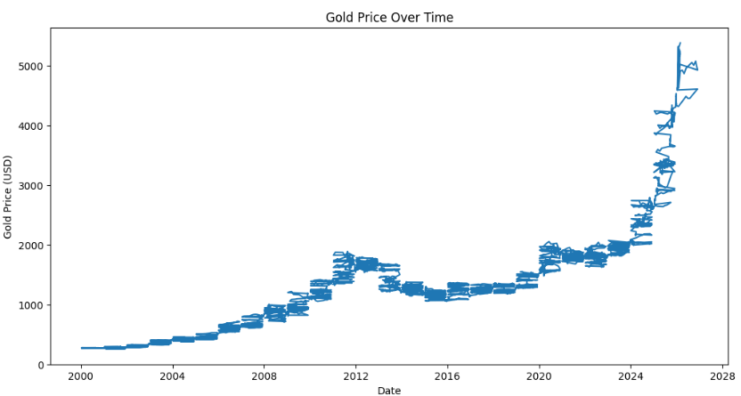
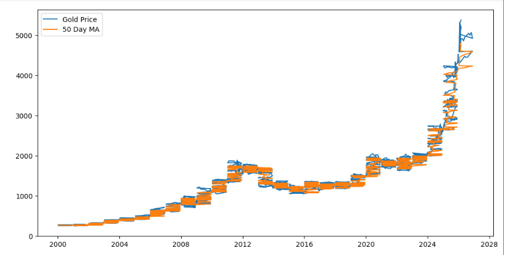
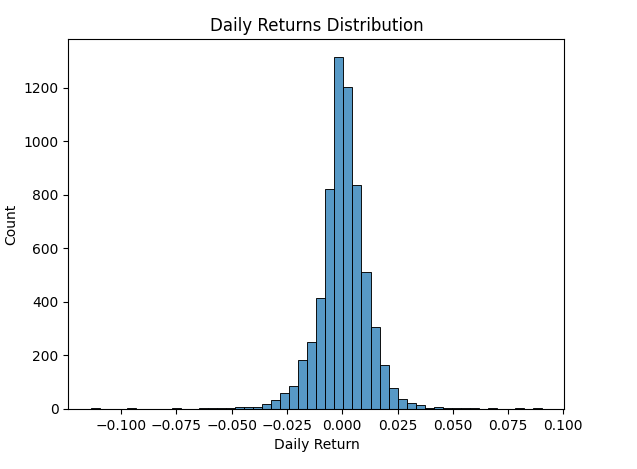
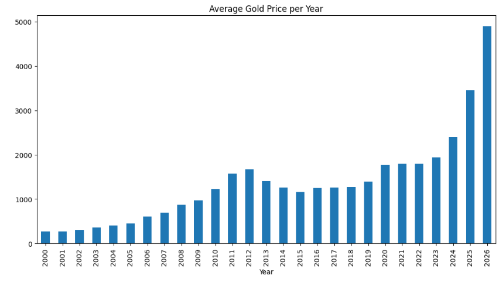
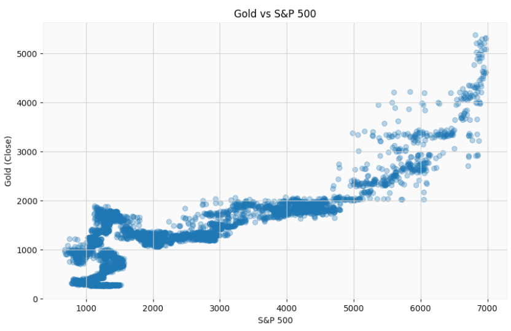
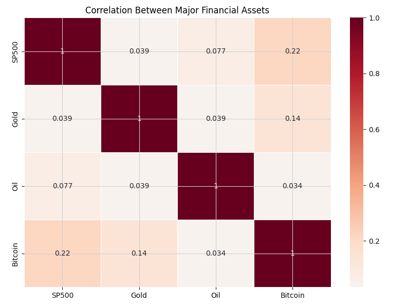

# Gold Market Analysis

This project analyzes historical gold prices and their relationship with major financial assets.

The analysis includes:

- Gold price trend over time
- Moving averages
- Daily returns distribution
- Yearly price evolution
- Correlation with S&P 500 and other assets

## Dataset

Historical gold price data (2000–2025).

## Tools Used

- Python
- Pandas
- Matplotlib
- Seaborn
- Jupyter Notebook

## Visualizations

### Gold Price Over Time

### Moving Average

### Daily Returns Distribution

### Average Gold Price Per Year

### Gold vs S&P500

### Financial Asset Correlation

## Insights

- Gold shows long-term upward trend.
- Gold has weak correlation with the S&P500.
- Gold acts as a diversification asset during market volatility.

## Author

Data Analysis Project – Portfolio
